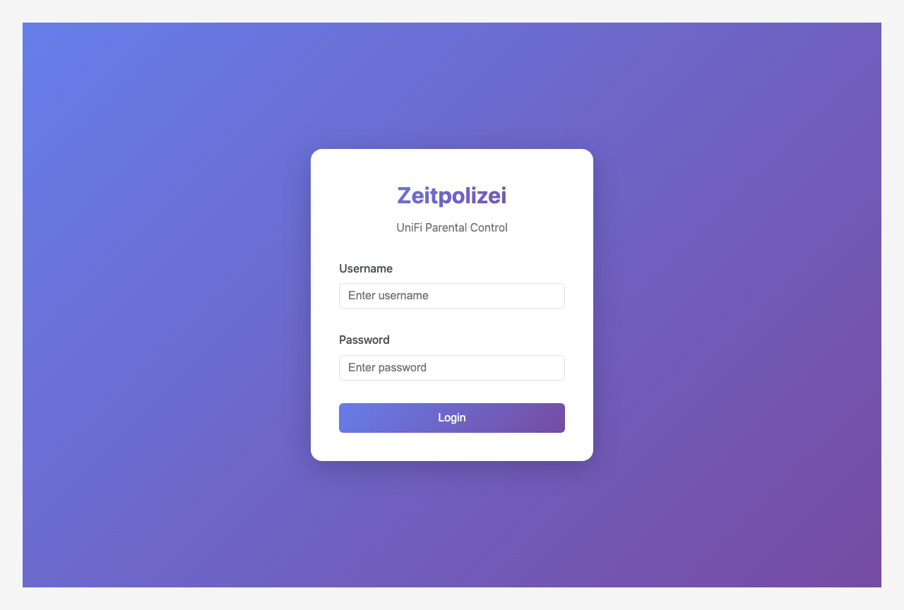
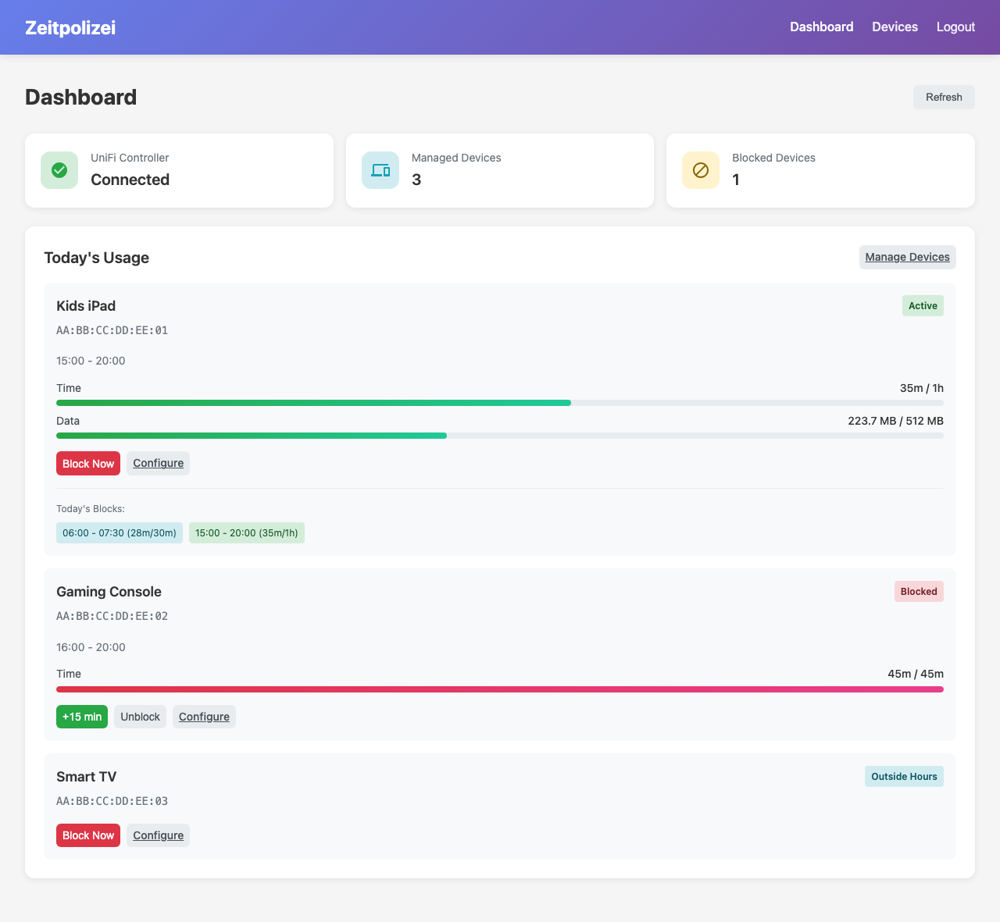
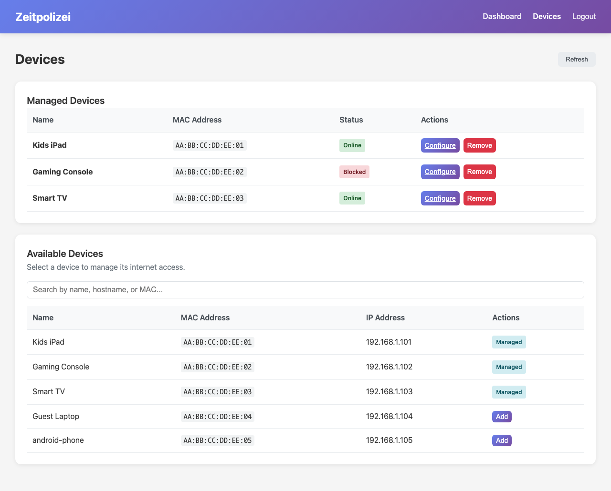
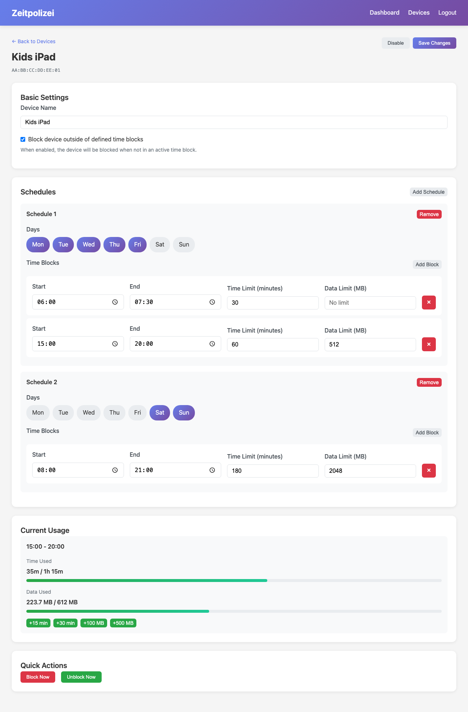

# Zeitpolizei User Guide

Welcome to Zeitpolizei - a parental control system for UniFi networks that helps you manage internet access for devices in your home.

## Table of Contents

1. [What is Zeitpolizei?](#what-is-zeitpolizei)
2. [Requirements](#requirements)
3. [Getting Started](#getting-started)
4. [Managing Devices](#managing-devices)
5. [Setting Up Schedules](#setting-up-schedules)
6. [Understanding Time Blocks](#understanding-time-blocks)
7. [Adding Bonus Time or Data](#adding-bonus-time-or-data)
8. [Troubleshooting](#troubleshooting)
9. [FAQ](#faq)

---

## What is Zeitpolizei?

Zeitpolizei (German for "Time Police") is a parental control application that works with your UniFi network equipment to:

- **Limit internet time** - Set daily time limits for devices like tablets, gaming consoles, or smart TVs
- **Limit data usage** - Cap how much data a device can use per time period
- **Schedule internet access** - Define when devices are allowed to connect
- **Block devices instantly** - Manually block or unblock devices with one click
- **Grant bonus time** - Easily give extra time when needed

Unlike built-in router features, Zeitpolizei gives you fine-grained control with multiple time blocks per day, different schedules for weekdays vs weekends, and the ability to combine time and data limits.

---

## Requirements

### Hardware

Zeitpolizei works with these UniFi devices:

| Device | Supported |
|--------|-----------|
| UniFi Dream Machine (UDM) | Yes |
| UniFi Dream Machine Pro (UDM Pro) | Yes |
| UniFi Dream Machine SE | Yes |
| UniFi Cloud Key | Yes |
| Self-hosted UniFi Controller | Yes |

### Network

- Zeitpolizei must be able to reach your UniFi controller
- For UDM devices: Usually at `https://192.168.1.1` (your gateway IP)
- For Cloud Key: Usually at `https://<cloud-key-ip>:8443`

### Credentials

You need a UniFi controller account with admin privileges to configure device blocking.

---

## Getting Started

### First-Time Setup

1. **Install Zeitpolizei** - Follow the [Installation Guide](INSTALL.md) for your platform

2. **Access the Web Interface** - Open your browser and go to:
   ```
   http://<server-ip>:8765
   ```

3. **Login** - Use the credentials you configured in `config.yaml`:

   

4. **Dashboard** - After logging in, you'll see the main dashboard:

   

### Understanding the Dashboard

The dashboard shows you:

- **UniFi Controller Status** - Whether Zeitpolizei can communicate with your network
- **Managed Devices** - How many devices you're controlling
- **Blocked Devices** - How many devices are currently blocked
- **Today's Usage** - Real-time usage for each managed device

---

## Managing Devices

### Adding a Device

1. Click **"Manage Devices"** on the dashboard or navigate to the Devices page

2. In the **"Available Devices"** section, find the device you want to manage:

   

3. Click **"Add"** next to the device

4. You'll be taken to the configuration page where you can set up schedules

### Viewing Device Status

On the Devices page, you can see:

- **Managed Devices** - Devices with active limits configured
- **Available Devices** - All devices on your network that can be managed
- **Status Badges**:
  - 🟢 **Online** - Device is connected and within limits
  - 🔴 **Blocked** - Device has exceeded limits or is manually blocked
  - ⚫ **Offline** - Device is not currently connected

### Removing a Device

1. Go to the Devices page
2. Find the device in the Managed Devices section
3. Click **"Remove"**
4. Confirm the removal

This will unblock the device and remove all limits.

---

## Setting Up Schedules

### Device Configuration Page

Click "Configure" on any managed device to access its settings:



### Basic Settings

- **Device Name** - A friendly name to identify the device
- **Block outside time blocks** - When enabled, the device is blocked when not in an active time window

### Creating Schedules

Schedules define when internet access is allowed and what limits apply.

1. Click **"Add Schedule"** to create a new schedule

2. **Select Days** - Choose which days this schedule applies to:
   - Click days to toggle them on/off
   - Common patterns: Weekdays (Mon-Fri) or Weekends (Sat-Sun)

3. **Add Time Blocks** - Define the allowed time windows within each day

### Example Schedule: School Week

For a child's tablet during the school week:

**Schedule 1: Weekdays**
- Days: Monday through Friday
- Time Block 1: 6:00 AM - 7:30 AM (30 min limit) - Morning before school
- Time Block 2: 3:00 PM - 8:00 PM (60 min limit) - After school

**Schedule 2: Weekends**
- Days: Saturday, Sunday
- Time Block: 8:00 AM - 9:00 PM (180 min limit, 2GB data limit)

---

## Understanding Time Blocks

A time block defines a window when internet access is allowed, along with optional limits.

### Time Block Settings

| Setting | Description |
|---------|-------------|
| **Start Time** | When the time block begins (e.g., 15:00) |
| **End Time** | When the time block ends (e.g., 20:00) |
| **Time Limit** | Maximum active minutes allowed (optional) |
| **Data Limit** | Maximum data transfer allowed (optional) |

### How Limits Work

- **Time Limit**: Counts actual active usage, not the full window duration. If a device uses the internet for 5 minutes, it consumes 5 minutes of the limit.

- **Data Limit**: Counts both upload and download traffic combined.

- **Combined Limits**: When both time and data limits are set, the device is blocked when *either* limit is reached first.

### What Happens When a Limit is Reached?

1. The device is automatically blocked via the UniFi controller
2. The dashboard shows the device as "Blocked"
3. The device cannot access the internet until:
   - The current time block ends, OR
   - Bonus time/data is added, OR
   - The device is manually unblocked

### Outside Time Blocks

When "Block outside time blocks" is enabled:
- Device is blocked when not in any active time block
- Device is automatically unblocked when a time block starts

When disabled:
- Device has unrestricted access outside of time blocks
- Limits only apply during defined time windows

---

## Adding Bonus Time or Data

Sometimes you need to give a device extra time - maybe as a reward, for homework, or for a special occasion.

### From the Dashboard

1. Find the blocked device on the dashboard
2. Click the **"+15 min"** button for quick bonus time
3. The device is automatically unblocked

### From the Device Configuration

For more options, go to the device's configuration page:


Available bonus options:
- **+15 min** - Add 15 minutes of time
- **+30 min** - Add 30 minutes of time
- **+100 MB** - Add 100 megabytes of data
- **+500 MB** - Add 500 megabytes of data

### Notes on Bonus Time

- Bonus time/data is added to the current time block only
- It resets when the time block ends
- Bonus applies to the specific limit that was reached (time or data)

---

## Troubleshooting

### Connection Issues

**Problem**: Dashboard shows "UniFi Controller: Disconnected"

**Solutions**:
1. Verify your UniFi controller is running
2. Check the `unifi.url` in your config file
3. Ensure the username/password are correct
4. For UDM devices, set `is_udm: true` in config
5. If using self-signed certificates, set `insecure: true`

### Device Not Appearing

**Problem**: A device doesn't show up in Available Devices

**Solutions**:
1. Ensure the device is connected to your UniFi network
2. Click "Refresh" on the Devices page
3. The device may take a few minutes to appear after connecting
4. Check that Zeitpolizei has access to the correct UniFi site

### Blocking Not Working

**Problem**: A device exceeds limits but isn't blocked

**Solutions**:
1. Verify the device's MAC address is correct
2. Check that the device config has `enabled: true`
3. Ensure the UniFi credentials have admin privileges
4. Check Zeitpolizei logs for errors

### Usage Not Tracking

**Problem**: Usage shows 0 even though the device is active

**Solutions**:
1. Verify the UniFi controller is providing statistics
2. Check `activity_min_bytes` setting (default 1024 bytes)
3. Some devices may use very little data when idle

---

## FAQ

### How accurate is the time tracking?

Zeitpolizei polls the UniFi controller every 30 seconds (configurable) and checks for data transfer. If a device has transferred more than the minimum threshold (default 1KB), it counts as an active minute.

### Can I set different limits for different time blocks?

Yes! Each time block can have its own time and data limits. For example:
- Morning: 30 minutes
- After school: 60 minutes with 500MB limit
- Evening: No limits (just the time window)

### What happens during a power outage?

When Zeitpolizei restarts:
- It reconnects to the UniFi controller
- Previously blocked devices remain blocked in UniFi
- Usage tracking resumes from saved data
- Daily usage resets at midnight

### Can I run Zeitpolizei on my router directly?

Yes, for UDM/UDM Pro/SE devices, you can install Zeitpolizei directly on the router using the on_boot.d scripts. See the [Installation Guide](INSTALL.md) for details.

### Does Zeitpolizei work with VLANs?

Yes, Zeitpolizei manages devices by MAC address, which works across VLANs as long as the UniFi controller can see the device.

### Can multiple parents use Zeitpolizei?

Currently, Zeitpolizei has a single admin account configured in the config file. All users share this login.

### How do I backup my configuration?

Your device configurations are stored in a SQLite database (default: `zeitpolizei.db`). Simply backup this file along with your `config.yaml`.

### Can I see historical usage?

Yes, the API provides historical usage data. Access it at:
```
GET /api/v1/usage/{mac}/history?days=30
```

A historical view in the web UI is planned for a future release.

---

## Getting Help

- **Issues**: Report problems at [GitHub Issues](https://github.com/nadilas/zeitpolizei/issues)
- **Documentation**: Full technical docs in the [README](../README.md)
- **API Reference**: See the README for all available API endpoints
